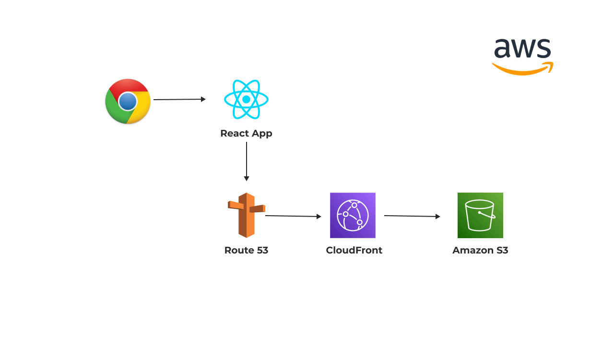
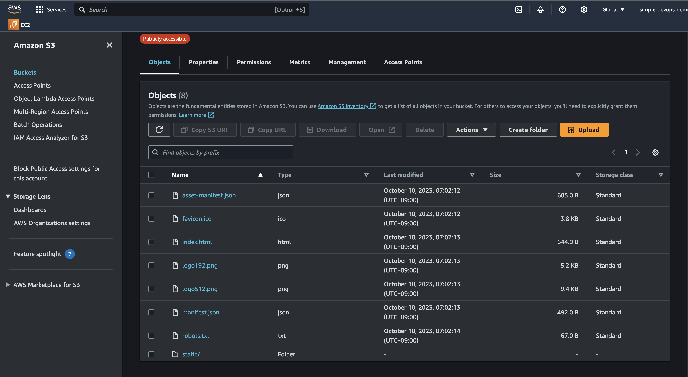

# Deploy-a-Hello-World-React-app-to-AWS-using-S3-CloudFront-ACM-Route53 | AWS-Project
In this repo, I walk you through how to deploy a Hello World React app to AWS using S3, CloudFront, ACM, Route53, and more! Using this approach, you can build a simple react based application that can scale to hundreds of thousands of users. This is a walkthrough documentation with thorough explanations of each step. 



# AWS Services that we are going to use in this project are following:

## Amazon S3 (Simple Storage Service):
- S3 is a scalable object storage service that allows you to store and retrieve data, including files, images, and backups, on the internet.
- It provides high durability, availability, and security for your data.
- S3 is commonly used for static website hosting, data backup, and as a storage backend for various applications.

## Amazon CloudFront:

- CloudFront is a content delivery network (CDN) service that accelerates the delivery of web content, including static and dynamic assets, to users around the world.
- It caches content at edge locations globally, reducing latency and improving website and application performance.
- CloudFront can also provide secure and scalable distribution for APIs and streaming media.

## AWS Certificate Manager (ACM):

- ACM is a service that simplifies the process of obtaining and managing SSL/TLS certificates for your websites and applications.
- It offers free SSL/TLS certificates that can be used with AWS services like CloudFront, Elastic Load Balancing, and API Gateway.
- ACM automates certificate renewal and provides a highly secure way to enable HTTPS

## Amazon Route 53:

- Route 53 is a scalable and highly available domain name system (DNS) web service.
- It allows you to register and manage domain names and route incoming traffic to various AWS resources, including S3 buckets, CloudFront distributions, and EC2 instances.
- Route 53 also offers advanced features like health checks and traffic routing policies for high availability and fault tolerance.

# Project Steps to follow:

1. Set up your React app or copy your existing React app code into the project directory and install dependencies and build your React app:

Make sure you have npm/npx installed!
Run following codes in your terminal

   ```
    npx create-react-app demo-app 
    cd demo-app
    npm start
    # Run Control + C to exit and run following code:
    npm run build
   ```

2. Create Amazon S3 buckets. In this 2nd stage you're going to create two S3 buckets one with www and one with actual name of your website

- Create your first bucket with www and make sure to choose bucket name same as your website like:
   - Bucket name: I will use awsprojects.com as an  example but make sure to choose same name as your website name.
   - Bucket name: www.awsprojects.com
   - Leave all the default configurations and we will comeback again later in the following steps

- Create your second bucket without www:
   - Bucket name: awsprojects.com
   - Leave all the default configurations

3. Upload your React App build files to www bucket:
   - Go to your www.awsprojects.com bucket and upload all the files by going to demo-app folder -> build and make to upload static folder seperately
   - Here is an example image that shows you uploaded React app build files:
    
  

4. Next we need to allow permission to our www bucket.
   - Click on #www.awsprojects.com bucket and go to Permissions and edit Block public access to off which means that you need to incheck it
   - Next you need to edit Bucket policy and use following code:
   - Copy and Paste following code: https://gist.github.com/beabetterdevv/af24011e668df12756b9dae5c2b4ba46 
   - Make sure to change Bucket-Name with your www bucket name anda in this example I will also change it to #www.awsprojects.com
   - Next go to Properties and enable Static Website Hosting and for Hosting Type choose: Host a Static Website, For Index document write: index.html
   - Now to go your #awsprojects.com bucket (without www) and enable Static Website Hosting but this time change Hosting Type to Redirect request for an object, and for Host name choose www buckey which is www.awsprojects.com, and for Protocol make sure to choose http for now and we will change it to https later

5. Create DNS records in Route 53
   - First make sure register domain name and if you have not watch this video: [](https://www.youtube.com/watch?v=5IfDzpkLlYY)
   - Create DNS records and in order to do that first for Routing policy select: Simple Routing and define simple record and follow this image:
   ```
   Record Name: www
   Record Type: A - Routes traffic to an IPv4 address and some AWS resources
   Value/Route traffic to: Alias to S3 website endpoint
   Choose same region that you chose for your buckets
   Choose s3 bucket
   Desable Evaluate target health
   ```
- Create second record:
 ```
   Record Name: leave this as default
   Record Type: A - Routes traffic to an IPv4 address and some AWS resources
   Value/Route traffic to: Alias to S3 website endpoint
   Choose same region that you chose for your buckets
   Choose s3 bucket
   Desable Evaluate target health
   ```

6. Configure AWS Certificate Manager
   - Click on Request a certificate
   - Type your domain name example: #www.awsprojects.com
   - Add another name and type: #awsprojects.com
   - Next select DNS validation for validation method
   - Confirm and request
  
7. Create distributions using CloudFront
   - Click on create distribution -> get started
   ```
   Origin Domain Name: (copy and paste your bucket (www.awsprojects.com) endpoint)
   Viewer Protocol Policy: select Redirect HTTP to HTTPS
   Alternative Domain Names: www.awsprojects.com
   SSL Certificate: (select certifacte you created in earlier stages)
   Leave everything else as default and create distribution
   ```
   - Create Distribution for another version which non wwww
   ```
   Origin Domain Name: (copy and paste your bucket (www.awsprojects.com) endpoint)
   Viewer Protocol Policy: select Redirect HTTP to HTTPS
   Alternative Domain Names: awsprojects.com
   SSL Certificate: (select certifacte you created in earlier stages)
   Leave everything else as default and create distribution
   ```

8. Change Protocol of non www bucket
   - Go to S3 -> Buckets -> awsprojects.con 
   - Go to properties and edit static website hosting
   - Change Protocol from http to https and save changes

9. Modify A records to point CloudFront instead of pointing to S3
   - Go to Route 53 -> Hosted zones and select www.awsprojects.com record and change Route traffic from Alias to S3 website endpoint to Alias to CloudFront distribution and choose suggested distribution
   - Do exact same with non wwww: select awsprojects.com change Route traffic from Alias to S3 website endpoint to Alias to CloudFront  distribution and choose suggested distrubution
  
10. Hope you have successefully finisjed your project 
   - Check your website and make sure you see lock which means we are using https and our connection is secure
   - Congratilations!! Hope you have finished your project


# Resources that I used:

   - Simple DevOps (Watch Project Overview  Video from Me): https://youtu.be/93I8bx1MKwo?si=Sq0LDJCRK6sLxxuD
   - Be a Better Dev (Watch Full Project Video): https://www.youtube.com/watch?v=mls8tiiI3uc
 
  
